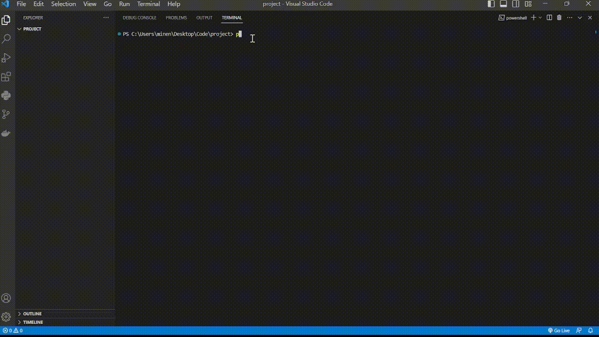

# Gitigno - A CLI Tool to Generate .gitignore Files

Gitigno is a command-line interface (CLI) tool that simplifies the process of generating `.gitignore` files for your projects. It utilizes the gitignore.io API to fetch a list of available templates and allows you to create a customized `.gitignore` file based on the technologies and frameworks you are using in your project.

## Preview


## Features

- Fetches a list of available templates from gitignore.io API.
- Generates a customized `.gitignore` file based on your selected templates.
- Easy-to-use CLI interface with clear instructions.

## Installation

To install Gitigno, you can use pip:

```
pip install gitigno
```

## Usage

After installing Gitigno, you can use the `gitigno` command to interact with the tool. Here are the available commands:

### Show Available Templates

To see a list of available templates, use the following command:

```
gitigno --tnames
```

This will display a table with all the available template names from gitignore.io.

### Create .gitignore File

To generate a `.gitignore` file based on selected templates, use the following command:

```
gitigno create -t <template_name1>,<template_name2>,...
```

Replace `<template_name1>,<template_name2>,...` with the names of the templates you want to include in your `.gitignore` file, separated by commas. For example:

```
gitigno create -t python,java,django
```

This will create a `.gitignore` file in the current directory with the specified templates.

## Examples

- To generate a `.gitignore` file for a Python project, use:

```
gitigno create -t python
```

- To generate a `.gitignore` file for a Node.js project, use:

```
gitigno create -t node
```

## License

This project is licensed under the MIT License - see the [LICENSE](LICENSE) file for details.

## Contributing

Contributions are welcome! If you find any issues or have suggestions for improvement, feel free to open an issue or submit a pull request.

## Acknowledgments

- Special thanks to the gitignore.io team for providing the API used by this tool.

## Author

Gitigno is maintained by [Minenhle Ngubane](https://github.com/Minenhle-Ngubane).

---

By using Gitigno, you can streamline the process of creating `.gitignore` files for your projects, ensuring that you don't accidentally commit unnecessary files or directories to your version control system. Happy coding!